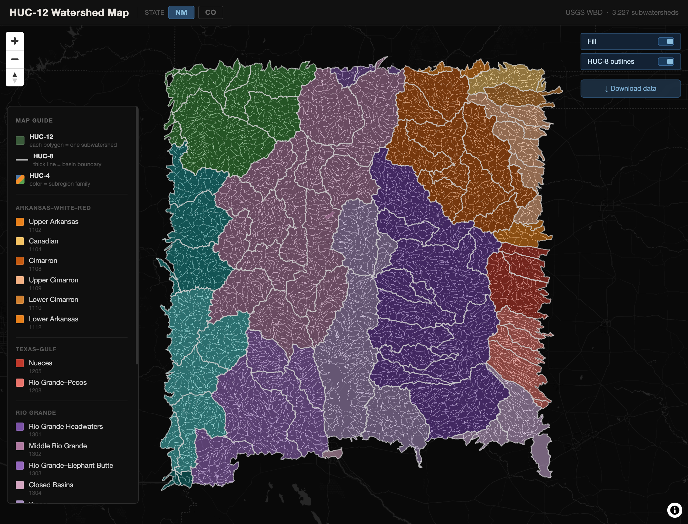

# HUC-12 Watershed Pipeline

A per-state pipeline that fetches USGS HUC-12 subwatershed boundaries and
produces publication-quality static maps and a fast interactive web map.
One command → GeoJSON, GeoParquet, GeoPackage, CSV, PMTiles, PNG, and PDF.

Live [demo map](https://rgdonohue.github.io/huc12-pipeline/).



## Gallery

| New Mexico | Colorado |
|---|---|
| 3,227 HUC-12 · 19 HUC-4 · 130,043 sq mi | 3,158 HUC-12 · 17 HUC-4 · 110,853 sq mi |

## Quick Start

```bash
# 1. Clone and set up
git clone https://github.com/rgdonohue/huc12-pipeline
cd huc12-pipeline
python3 -m venv .venv
.venv/bin/pip install -r requirements.txt

# 2. Fetch HUC-12 data for any state
.venv/bin/python scripts/fetch_huc12.py --state NM

# 3. Render a static map (PNG + PDF)
.venv/bin/python scripts/map_static.py --state NM --dpi 300

# 4. Serve the interactive web map
# PMTiles requires a server that supports HTTP Range requests
npx serve . -p 8000
# → open http://localhost:8000/
```

**Or install as a package** (`pip install -e .`) and use the CLI directly:

```bash
huc12-fetch --state CO
huc12-render --state CO --dpi 300
```

## What the pipeline produces

For each `--state XX` run:

| File | Description |
|---|---|
| `data/processed/huc12_<xx>.geojson` | HUC-12 polygons, EPSG:4326 |
| `data/processed/huc12_<xx>.parquet` | GeoParquet (fast re-analysis) |
| `data/processed/huc12_<xx>.gpkg` | GeoPackage (QGIS/ArcGIS ready) |
| `data/processed/huc12_<xx>_summary.csv` | Tabular reference |
| `data/processed/huc12_<xx>.pmtiles` | Vector tiles for the web map |
| `data/processed/huc8_<xx>.geojson` | HUC-8 basin dissolve (with basin names) |
| `data/processed/huc8_<xx>.pmtiles` | HUC-8 vector tiles |
| `data/processed/huc12_<xx>_<huc8>.geojson` | Per-basin subset, one file per HUC-8 in the state |
| `data/processed/huc12_<xx>_meta.json` | Counts, HUC codes, basin names, per-basin sizes (read by web map) |
| `output/huc12_<xx>.png` | Static map (configurable DPI) |
| `output/huc12_<xx>.pdf` | Vector static map |

## Interactive web map

`index.html` is a self-contained MapLibre GL JS map. It reads PMTiles from
`data/processed/` so initial page load is a few KB — the browser fetches only
the tiles currently in view via HTTP range requests.

Features:
- HUC-12 polygons colored by HUC-4 subregion (no adjacent collisions)
- HUC-8 basin boundaries as a separate overlay, with named basins in the legend
- Hover-highlight + cross-hover between map and legend
- Click any HUC-12 for a popup with codes, area, containing basin name, and a basin-scoped download link
- Click an HUC-8 on the map (or its legend row) to pin the basin — non-members dim, the download panel surfaces the per-basin GeoJSON
- Full-state downloads (GeoJSON, GeoPackage, CSV) in the corner panel
- Optional `?projects=<url>` query param: paints externally-tracked HUC-12s gold, shows project metadata in the popup — useful for "here's where our work lives inside the basin" maps without forking this repo

Switch states via URL: `?state=nm` or `?state=co`. The `CONFIG` block at the top of `index.html` is derived from that param; edit only if you want to add a new state's data paths or change the download host.

**Projects overlay.** Host a JSON file shaped like:

```json
{
  "name": "My org projects",
  "projects": [
    { "huc12": "130202010101", "name": "Site A", "status": "active", "url": "https://…" }
  ]
}
```

Then load the map with `?projects=https://your-host/projects.json` (the source needs CORS enabled). Supports `name`, `status`, `description`, and `url` per entry.

## PMTiles requirement

The web map uses PMTiles. To generate them, install
[Tippecanoe](https://github.com/felt/tippecanoe) (`brew install tippecanoe`
on macOS). The fetch pipeline calls Tippecanoe automatically if it's in your
PATH. You can also run it manually:

```bash
tippecanoe -Z5 -zg --drop-densest-as-needed --no-feature-limit \
  -l huc12 -o data/processed/huc12_nm.pmtiles \
  data/processed/huc12_nm.geojson
```

## Data source

USGS Watershed Boundary Dataset (WBD), served via the
[National Map ArcGIS REST API](https://hydro.nationalmap.gov/arcgis/rest/services/wbd/MapServer).
No API key required. Public domain.

HUC-12 (subwatershed) is the finest standard WBD unit (~40–250 sq mi). Each
feature carries the full HUC hierarchy (huc2–huc12) derived in the pipeline.

- [National Map Viewer](https://apps.nationalmap.gov/viewer/)
- [WBD product page](https://www.usgs.gov/national-hydrography/watershed-boundary-dataset)

---

Built by [Small Batch Maps](https://smallbatchmaps.com) — independent cartography focused on clarity and craft.
